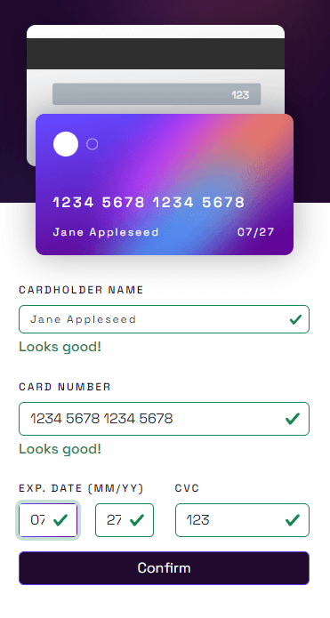

Certainly! Below is the updated README.md file tailored to the project based on the information provided:

---

# Interactive Card Details Form Solution

This is a solution to the [Interactive card details form challenge on Frontend Mentor](https://www.frontendmentor.io/challenges/interactive-card-details-form-XpS8cKZDWw). Frontend Mentor challenges help you improve your coding skills by building realistic projects.

## Table of Contents

- [Overview](#overview)
  - [The Challenge](#the-challenge)
  - [Screenshot](#screenshot)
  - [Links](#links)
- [Project Details](#project-details)
  - [App.jsx](#appjsx)
  - [FormCard.jsx](#formcardjsx)
  - [Card.jsx](#cardjsx)
- [Installation](#installation)
- [Usage](#usage)
- [Scripts](#scripts)
- [Dependencies](#dependencies)
- [Dev Dependencies](#dev-dependencies)

## Overview

### The Challenge

Users should be able to:

- Fill in the form and see the card details update in real-time
- Receive error messages when the form is submitted if:
  - Any input field is empty
  - The card number, expiry date, or CVC fields are in the wrong format
- View the optimal layout depending on their device's screen size
- See hover, active, and focus states for interactive elements on the page

### Screenshot




### Links

- Solution URL: [Add solution URL here](https://your-solution-url.com)
- Live Site URL: [Add live site URL here](https://your-live-site-url.com)

## Project Details

### App.jsx

- **useState**: Each `useState` creates a local state in the App component. They are used to store information such as the cardholder's name (`name`), card number (`cardNumber`), expiration month (`month`), year (`year`), and security code (`cvc`).
- **Container, Row, Col**: React Bootstrap components used for responsive layout. `Container` defines the main structure of the application, `Row` organizes components into rows, and `Col` divides horizontal space to position the `Card` and `FormCard` components side by side.
- **Card and FormCard**: Components imported from `Card.jsx` and `FormCard.jsx`. `Card` displays card details based on the local states defined in `App`, while `FormCard` allows users to input and validate card data, updating local states in `App`.
- **Props**: Props are passed from `App` to `Card` and `FormCard` to facilitate data communication between components. Each property and function is documented to explain its role within the `App` component.

### FormCard.jsx

- **useState**: Manages local states (`validated`, `showModal`) in the functional component `FormCard`.
- **handleSubmit**: Function called when submitting the form. Checks if the form is valid. If not, prevents default submission and event propagation. If valid, prevents default submission and shows a confirmation modal (`showModal`).
- **handleContinue**: Function to reset form fields and states after the confirmation modal is shown. Resets validation states, input fields, and hides the modal.
- **Form and Modal**: Conditional rendering based on the `showModal` state. The form is displayed if `showModal` is `false`. The confirmation modal is displayed if `showModal` is `true`, after successful form submission.
- **Validations**: Uses regex patterns for name, card number, month, year, and CVC fields to ensure valid input. Provides visual feedback to users using React Bootstrap (`Form.Control.Feedback`) to indicate invalid fields.
- **PropTypes**: Defines PropTypes to ensure that required functions (`setName`, `setCardNumber`, `setMonth`, `setYear`, `setCvc`) are correctly passed as props to `FormCard`.

### Card.jsx

- **Container**: React Bootstrap component wrapping the card content, defining its main structure.
- **card-front**: Div representing the front part of the card, displaying the logo, card number, cardholder's name, and expiration date.
- **Image**: React Bootstrap component used to display the card logo image.
- **card-back**: Div representing the back part of the card, displaying the security code (CVC).
- **Placeholders**: Default values displayed if fields (`name`, `cardNumber`, `month`, `year`, `cvc`) are empty.
- **PropTypes**: Defines expected properties (`name`, `cardNumber`, `month`, `year`, `cvc`) for the `Card` component to validate received data types.
- **Export default**: Default export of the `Card` component for use in other React components.

## Installation

Make sure you have Node.js and npm installed. Clone this repository, navigate to the project directory, and install dependencies:

```bash
git clone https://github.com/your_username/interactive-card-details-form.git
cd interactive-card-details-form
npm install
```

## Usage

To start the development server:

```bash
npm run dev
```

Open [http://localhost:3000](http://localhost:3000) in your browser to view the application.

## Scripts

- `npm run dev`: Starts the development server using Vite.
- `npm run build`: Builds the production-ready bundle for deployment.
- `npm run lint`: Runs ESLint to lint all JavaScript and JSX files.
- `npm run preview`: Previews the production build locally using Vite.

## Dependencies

- **React**: JavaScript library for building user interfaces.
- **React DOM**: React package for DOM rendering.
- **React Bootstrap**: React components for Bootstrap framework.
- **Bootstrap**: Front-end framework for designing websites and web applications.
- **Prop Types**: Runtime type checking for React props and similar objects.
- **Sass**: CSS extension language.

## Dev Dependencies

- **ESLint**: Pluggable JavaScript linter.
- **@types/react**: TypeScript types for React.
- **@vitejs/plugin-react-swc**: Vite plugin for React.
- **eslint-plugin-react**: ESLint rules specific to React.
- **eslint-plugin-react-hooks**: ESLint rules for React hooks.
- **eslint-plugin-react-refresh**: ESLint plugin for React Fast Refresh.
- **Vite**: Next generation front-end tooling.
